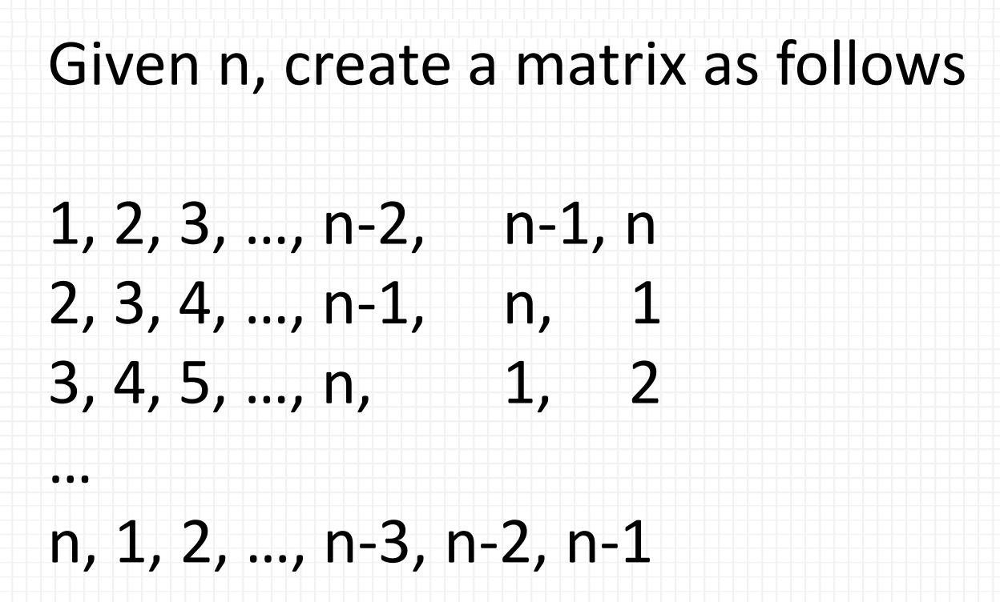
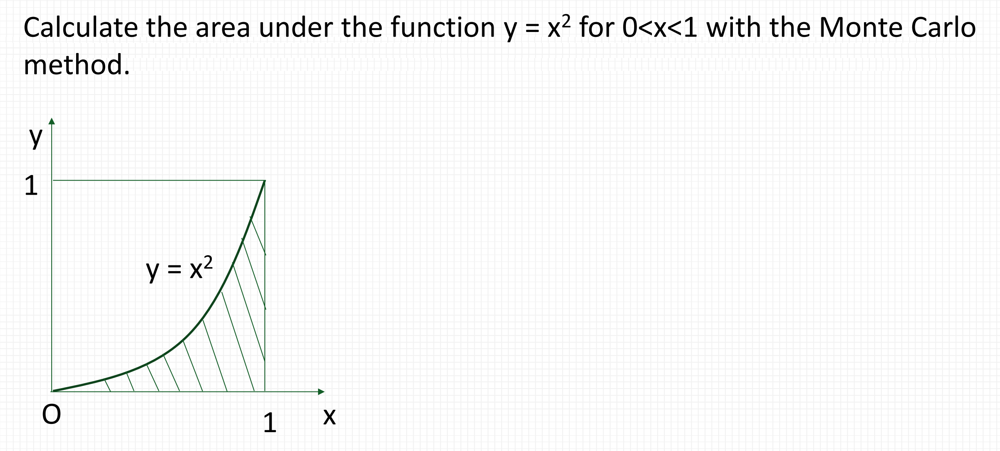

# ENGR1010: lecture 4 - How I discovered Calculus
## Key take aways from the lecture
Logical and relation operations;
Branch – if and switch statements;
Loop – while and for statements;
Random numbers.

## Practice in class and how I weirdly discovered Calculus
### First practice question: RIO MatrixLab

  

I didn't realize we can actually add new rows to a matrix in MATLAB and I kept thinking about how to find a one-size-fit-all way to
present the numbers and was stuck, so I thought I encountered a problem of maths.

Instead this is just programming. We can modify the rows separately so we don't need to find the formula for the whole matrix. In fact we can easily present each vector of a row and put them all together to form a matrix! Smart!

### Second practice question: How I discovered Calculus without knowing

  

Here comes the fun part. For this assignment, I wrote a weird piece of code that creates a 100*100 matrix, assigned a random value between 0 and 1 to every scalar, and sort of compared the assigned value with the square of the number of row. It sounded weird even to me, because I didn't use the column assigned, and couldn't find a way to do so. However, the really weird thing is, the answer actually came out right!
