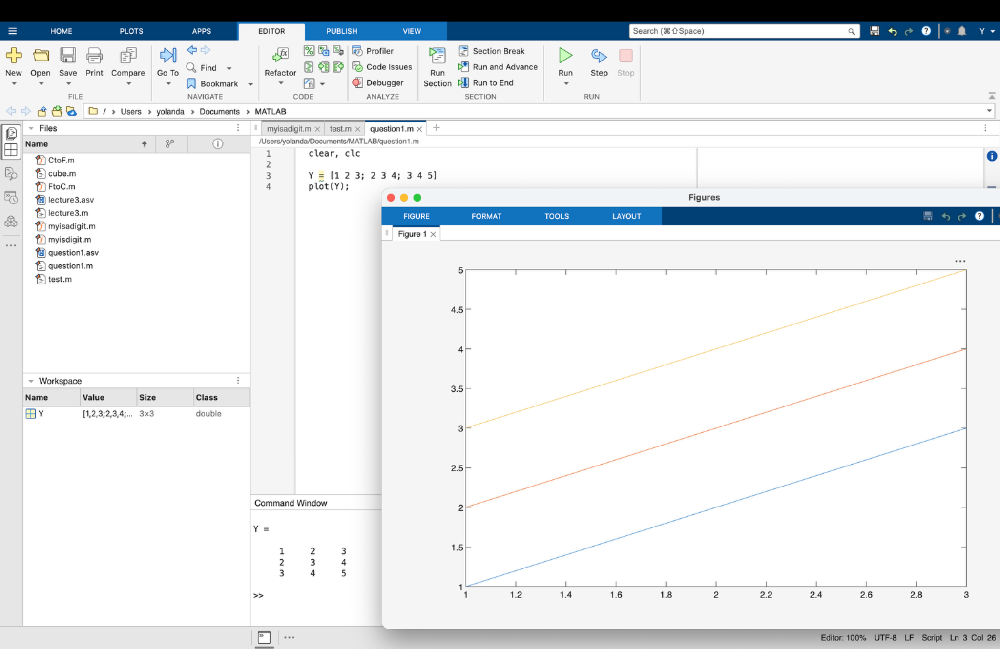
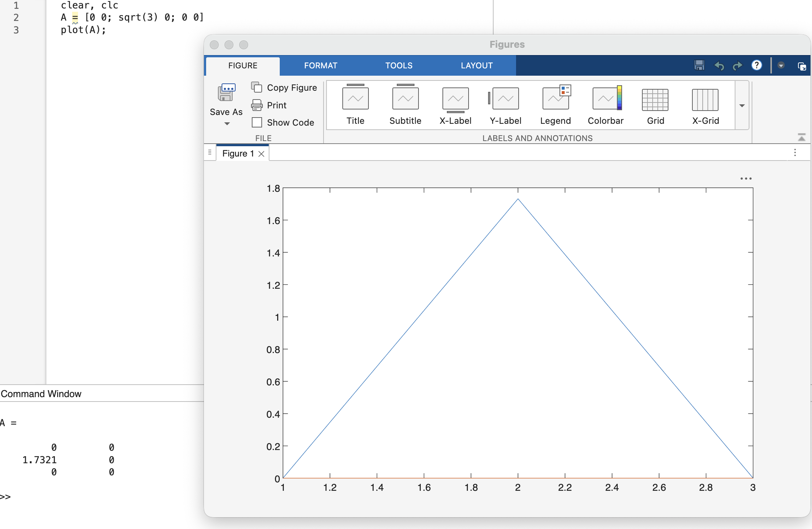

# ENGR1010: lecture 4 - Plotting strange things
## Key take aways from the lecture
MATLAB figure;
Two-dimensional plot;
Three-dimensional plot

## Plotting strange things: how I plotted a matrix
We were learning the function _plot(y)_ in class, and I accidentally put the capitalized _Y_ (which was a matrix in my workspace) inside the parentheses instead of the lower-cased y. And suddenly I got three lines instead of one!

  

After going through the codes, I finally found out what went wrong and quickly corrected it, but was still curious about what happened. Therefore, after class, I asked GPT about the picture. It told me that MATLAB uses default x-values when not given, and plots the row numbers as x-values, columns as different lines. Guess I can actually draw a triangle this way!

  

This is much easier than using the hold stuff!
