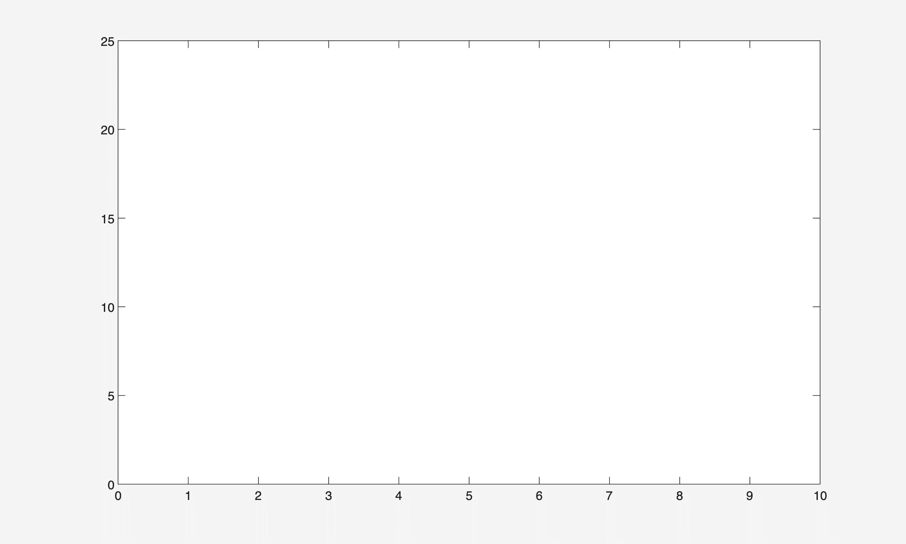

# ENGR1010: lecture 6 - First gif of my own!!!
## Key take aways from the lecture
Read, display and write images;
Multiple image processing methods;
Animation.

## First gif of my own! Well not entirely on my own but...
We were learning about how to read and display images...and even better...how to make gifs! The professor gave us an example of making a sin gif, which I was a bit confused on the mathematical part but anyways... Then the class was over and it is our turn to make our own parabola gif!

I did make many funny mistakes, such as making a completely blank gif: I only plotted a single dot so nothing appeared. But in the end I finally made my very first gif! Next time, I'll definitely be making something better, more complicated, maybe a mark?

  

Hey guess what I've got an idea! Wait for my newest update!
